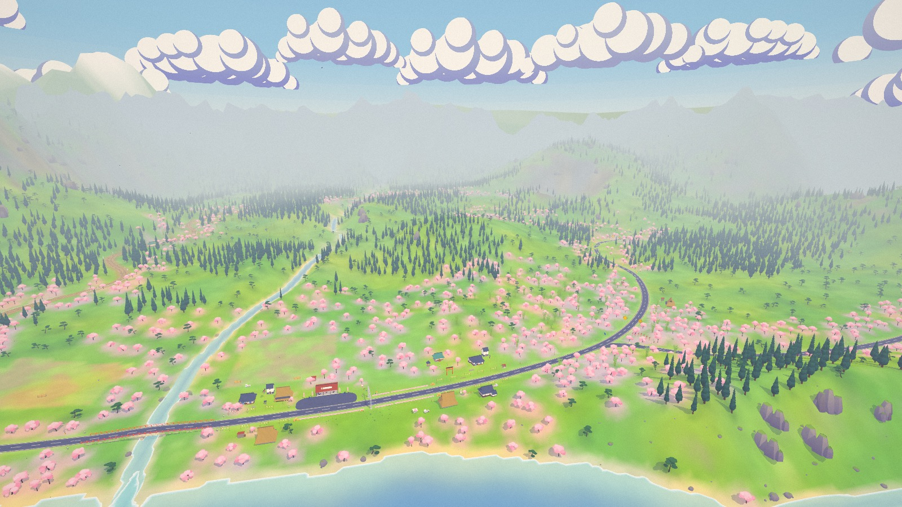
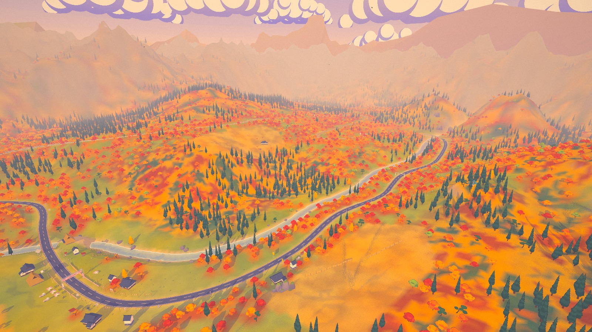
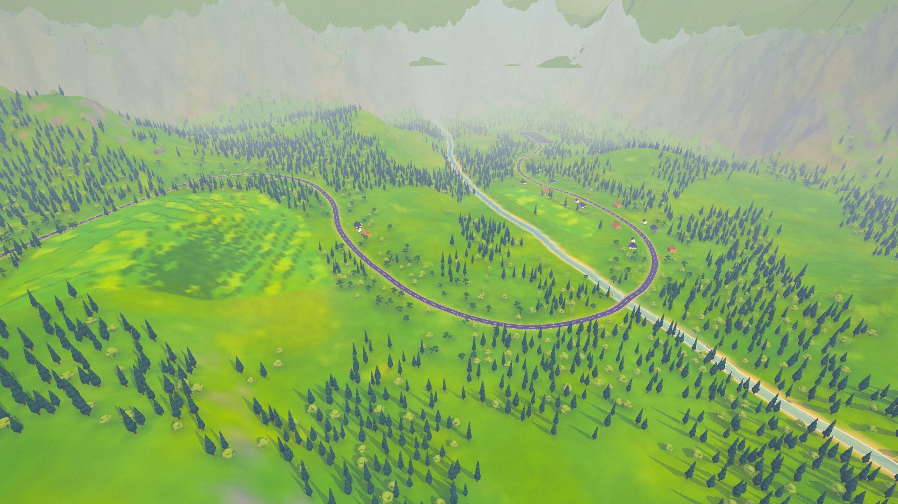

# Sakura Rally 桜ラリー

A cel-shaded low-poly rally game for Summer Engine and Godot 4.7. Two stages and a liaison road
drawn like an anime background: flat cel bands, shadows tinted violet instead of darkened, thin
ink lines, painted clouds and aerial haze. The look follows yamazakura, an earlier three.js
sakura bike ride by the same author.

Claude Opus 5.5 built it from one prompt in about five hours: the code, the car and prop models
(Blender scripts), both maps, the synthesised engine audio, the UI and the trailer edit. It split
the work across parallel sub-agents for the car, props, physics, audio and UI, which coordinated
through [docs/CONTRACTS.md](docs/CONTRACTS.md). A second round, from the author's playtest
notes, added the campaign with a drivable liaison road, a second car, the garage and a physics
rework aimed at fun rather than realism. The next playtest made crashes forgiving, turned the
roadside dressing soft and taught the title flyover car to drift.




## Play

Open the project in Summer Engine and press Play; `npx -y summer-engine@latest run .` opens it.
Stock Godot 4.7 runs it too: `godot --path .`. On macOS, `Play Sakura Rally.command` starts the
game directly with Summer, or with Godot when Summer is not installed.

The window opens at 16:9, sized to 80 % of the screen. Fullscreen is in Settings.

| Action | Keyboard | Gamepad |
|---|---|---|
| Throttle | W / ↑ | RT |
| Brake; hold at a standstill to reverse | S / ↓ | LT |
| Steer | A, D / ←, → | left stick |
| Handbrake | Space | A |
| Shift up / down (manual gearbox) | E / Q | RB / LB |
| Camera: chase, far chase, hood, bumper | C | Y |
| Put the car back on the road | R | Back |
| Pause | Esc / P | Start |
| Horn | H | L3 |
| Hide the UI for screenshots | F1 | |

During the countdown the car is held on the line. Hold the throttle: launch control keeps the
engine at 4600 rpm, and at GO the clutch drops into first.

## Modes and maps

- **Campaign, The Seasons Rally**: SS1 Hanami Pass in spring, then L1 Natsu Road, an untimed
  summer liaison you drive yourself to the next time control, then SS2 Momiji Valley in autumn.
  A journey map opens each leg; the finale is a rally classification against six rivals. Quit
  at any point and the title offers "Continue" at the start of that leg.
- **Time Attack**, a page of cards that show each road from above with its route:
  - **Time Trial**: one lap through checkpoints, with splits against your best, a medal and a
    saved record.
  - **Free Roam**: no timer, on any of the three roads. R puts you back on the route.

| Map | Setting | Gold / Silver / Bronze |
|---|---|---|
| Hanami Pass 花見峠 | spring noon, tarmac and gravel under the blossom | 2:04.5 / 2:18.0 / 2:41.0 |
| Momiji Valley 紅葉谷 | autumn golden hour, loose dirt through the maples | 1:49.5 / 2:01.5 / 2:21.5 |

Natsu Road 夏道 is the liaison between the two stages, a summer-afternoon road rather than a
lap. It is 2.2 km of open tarmac from a car park on Hanami Pass, down past terraced rice
paddies, over a stone bridge into a village holding its summer festival, along the forest edge
to the Momiji Valley time control, a service park where the car stops in the arrival zone.



The roadside is soft, as in Forza Horizon. Cones, tape, flags, banners, fences, benches, road
signs, tyre stacks and hay bales break when you drive through them and cost 1–12 % of your
speed. Checkpoints are fabric banners on soft uprights that billow as you pass. Trees, rocks,
walls, guardrails and buildings stay solid. Hitting them scrapes the car along the wall rather
than spinning it round, and nothing launches it. A restart or a reset (R) puts the course back
together.

The garage has two cars and five liveries, painted onto the parked car as you pick them:

| Car | Drivetrain | Character |
|---|---|---|
| Sakura 桜 | 2.0 turbo, AWD, 0–100 km/h 3.5 s | grips, forgives, flies |
| Hayate 疾風 | 1.6 twin-cam, RWD, 0–100 km/h 5.0 s, pop-up headlights | rev-happy coupe that slides when you ask it to |

Settings cover quality (low / medium / high), automatic or manual gearbox, camera, km/h or
mph, three volume sliders and fullscreen. The 3D view renders at most 1920×1080 pixels before
the quality scale, and FSR upscales bigger windows. A Retina fullscreen frame therefore costs
about as much as a 1080p window.

With Godot on macOS, settings and records live in
`~/Library/Application Support/Godot/app_userdata/Sakura Rally/sakura_rally.cfg`.

## Trailer

The trailer is rendered offline from the game itself: `tools/video/demo.gd` drives a scripted run
under Movie Maker, and `tools/video/cut_demo.py` cuts the footage on the beat of the drive theme.
`tools/video/render_demo.sh` does both, offscreen and muted (about 11 min for the footage under
`nice`, 4 min for the cut; ~11 GB of footage in `/tmp`), and writes
`/tmp/sakura_demo/sakura_rally_demo.mp4`. The run goes title → garage (a livery change) → Time
Attack → a showoff lap of Hanami under directed cuts (a fabric gate, the hay bales on the tarmac
hairpin) → results → Next map → Momiji → pause → back to the title.

## How it is built

| Part | Source | What it is |
|---|---|---|
| Cars | `tools/blender/build_car.py`, `build_car_hayate.py` → `assets/models/car/` | Low-poly rally car and coupe built by scripts. Tyre and rim are one object per wheel, spinning and steering; calipers steer without spinning |
| Physics | `scripts/vehicle/`, [docs/PHYSICS.md](docs/PHYSICS.md) | Custom raycast car on a `RigidBody3D` (Jolt, 120 Hz): suspension, a combined-slip tyre model per surface, 6-speed gearbox, turbo, AWD with limited-slip couplings or RWD, and assists tuned for fun: stability that lets deliberate drifts through, strong brakes, sharp turn-in. Crashes are arcade: walls take a share of speed that depends on the impact angle and ease the nose along them, poles deflect the car, and a short guard caps yaw, roll and climb after any hit |
| Look | `shaders/`, `scripts/fx/` | Toon ramps with violet shade bands, depth-based ink lines, anime colour grade, painted sky, petals, low-poly dust |
| Maps | `tools/mapgen/` → `assets/maps/` | Python map compiler: terrain, closed (stage) or open (liaison) road spline, surfaces, checkpoints, instances from an 86-prop kit (`tools/blender/build_props.py`), and a road corridor kept clear of rigid props. At runtime `scripts/world/soft_course.gd` tests the soft dressing against each car outside the solver, with pooled debris and fabric checkpoint gates |
| Audio | `tools/audio/`, [docs/AUDIO.md](docs/AUDIO.md) | Synthesised engine loops (8 on load, 8 off load), turbo whistle and blow-off, dog-box gearbox whine, tyre sounds per surface, UI and stingers. Music is ElevenLabs Music via fal; ambience is fal sound-effect beds with synthesised birds and crickets |
| UI | `scripts/ui/`, [docs/UI.md](docs/UI.md) | Title hub over a flyover whose car drifts the corners, Time Attack cards with top-down maps, garage, journey map, liaison HUD, settings, ink transitions, countdown, HUD, results, rally classification and pause, all built in code |

Shared conventions and the runtime APIs: [docs/CONTRACTS.md](docs/CONTRACTS.md). Rebuild commands:

```sh
G=/Applications/Godot.app/Contents/MacOS/Godot
/Applications/Blender.app/Contents/MacOS/Blender --background --factory-startup --python tools/blender/build_car.py
uv run --with numpy --with pillow python tools/mapgen/mapgen.py
timeout 180 $G --headless --disable-crash-handler --path . --import   # after changing raw assets
```

## Verification

Latest results, 2026-09-26, M1 Max, `S=/Applications/Summer.app/Contents/MacOS/Summer`:

```sh
timeout 2400 $S --headless --disable-crash-handler --fixed-fps 120 --path . -s res://tools/physics/run_tests.gd
timeout 400 $S --headless --disable-crash-handler --path . -s res://tools/game/flows.gd -- map=hanami
timeout 900 $S --headless --disable-crash-handler --path . -s res://tools/game/flows.gd -- flow=campaign speed=3
timeout 400 $S --headless --disable-crash-handler --path . -s res://tools/game/softcourse_probe.gd -- map=natsu
```

- Physics suite, both cars: 120/120 passed. Sakura does 0–100 km/h in 3.5 s, stops from
  100 km/h in 27 m, tops out at 189 km/h and holds 1.19 g on tarmac and 0.93 g on gravel;
  Hayate does 0–100 km/h in 5.0 s. Walls hit at 10°, 25° and 45°, at 90 and 130 km/h, cost
  5–6 %, 18 % and 41 % of the speed, with no spin and no air. Every row is in
  [docs/PHYSICS.md](docs/PHYSICS.md).
- Game flows on both stages (free roam, pause and resume, reset, restart during the countdown,
  launch, camera cycling, all three quality presets): 0 failures.
- The campaign end to end, the autopilot driving both stages and the liaison through the results,
  the arrival, the finale and the end card: 46 checks, 0 failures.
- Soft course probes on all three roads, with both cars: 0 failures.
- Crashing through the roadside does not cost frames: offscreen at 1600×900, frames with the car
  against rails and trees take 8.3 ms at the median and under 10 ms at p95, and the first smash
  of a session adds no hitch.
- Median FPS offscreen at 1600×900, low / medium / high: Hanami 120 / 115 / 96, Momiji
  113 / 87 / 77.

## License

Code and assets are MIT, see [LICENSE](LICENSE), except the fonts (Dela Gothic One, Yuji Syuku,
Zen Maru Gothic), which are under the SIL Open Font License 1.1; the licence texts are in
`assets/fonts/`. The music and the ambience beds were generated with ElevenLabs models on fal;
[docs/AUDIO.md](docs/AUDIO.md) lists the prompts and the provider terms.
