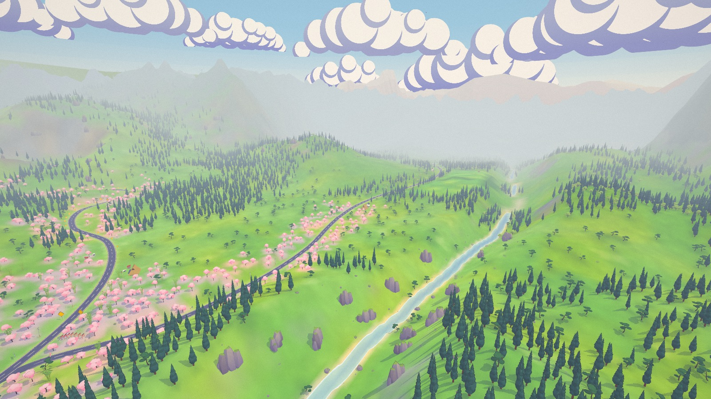

# Sakura Rally 桜ラリー

A cel-shaded low-poly rally game for Summer Engine and Godot 4.7: two stages joined by a road
through the seasons, in one world drawn like an anime background. Flat cel bands, shadows
tinted violet instead of darkened, thin ink lines, painted clouds and aerial haze. The look
follows yamazakura, an earlier three.js sakura bike ride by the same author.

Claude Opus 5.5 built it from one prompt in about five hours: the code, the car and prop models
(Blender scripts), both maps, the synthesised engine audio, the UI and the trailer edit. It split
the work across parallel sub-agents for the car, props, physics, audio and UI, which coordinated
through [docs/CONTRACTS.md](docs/CONTRACTS.md). A second round, from the author's playtest
notes, added the campaign with a drivable liaison road, a second car, the garage and a physics
rework aimed at fun rather than realism. The next playtest made crashes forgiving, turned the
roadside dressing soft and taught the title flyover car to drift. The third joined the stages
and the road into one world driven without loading between them. It also moved the garage into
a workshop by the road, added big corner signs and guardrails, made the chase camera see past
the car downhill, let spectators tumble when hit, and records every drive for review.




## Play

Open the project in Summer Engine and press Play; `npx -y summer-engine@latest run .` opens it.
Stock Godot 4.7 runs it too: `godot --path .`. On macOS, `Play Sakura Rally.command` starts the
game directly with Summer, or with Godot when Summer is not installed.

The window opens at 16:9, sized to 80 % of the screen. Fullscreen is in Settings.

| Action | Keyboard | Gamepad |
|---|---|---|
| Throttle | W / ↑ | RT |
| Brake; hold at a standstill to reverse | S / ↓ | LT |
| Steer | A, D / ←, → | left stick |
| Handbrake | Space | A |
| Shift up / down (manual gearbox) | E / Q | RB / LB |
| Camera: chase, far chase, hood, bumper | C | Y |
| Put the car back on the road | R | Back |
| Pause | Esc / P | Start |
| Horn | H | L3 |
| Hide the UI for screenshots | F1 | |
| AI drives your car / AI ghost cars / watch a ghost ([docs/RL.md](docs/RL.md)) | I / G / V | |

During the countdown the car is held on the line. Hold the throttle: launch control keeps the
engine at 4600 rpm, and at GO the clutch drops into first.

## Modes and maps

- **Campaign, The Seasons Rally**: one continuous drive with no loading between legs. SS1 is
  Hanami Pass in spring. At the finish the car rolls to a stop on the loop, the results say the
  stage is complete, and a road sign beside them points on to SS2. Continue opens the barrier
  across the branch road in front of you, and you drive on from where you stopped. The road is
  untimed, and it runs from the sakura through summer into the autumn maples. At Momiji Valley's
  grid the car comes to rest and the arrival card waits for you: Start SS2 plays the start card
  on the spot, then the countdown.
  The finale is a rally classification against six rivals. Quit at any point and the title
  offers "Continue" at that leg: SS1's grid, the road on from Hanami's finish, or SS2's grid.
- **Time Attack**, a page of cards that show each stage from above with its route:
  - **Time Trial**: one lap through checkpoints, with splits against your best, a medal and a
    saved record. The barriers to the branch road stay closed.
  - **Race**: two laps against the six rivals of the rally, each in their own car and colours
    and driven by the trained AI at their campaign pace for the stage. You start last on a
    staggered grid behind them, slowest on pole; cars bump, push and rub each other. The HUD
    shows your place with the gaps to the cars just ahead and behind, the results your position
    and the classification, which fills in as the others take the flag. No record, no medal.
  - **Free Roam**: no timer and every barrier open, so the whole world is yours. R puts you
    back on the nearest road.

| Stage | Setting | Gold / Silver / Bronze |
|---|---|---|
| Hanami Pass 花見峠 | spring noon, tarmac and gravel under the blossom | 2:04.5 / 2:18.0 / 2:41.0 |
| Momiji Valley 紅葉谷 | autumn golden hour, loose dirt through the maples | 1:49.5 / 2:01.5 / 2:21.5 |

The stage loops are 10 m wide, room for two cars side by side. The road between the stages is
2 km of 7 m open tarmac on a summer afternoon: it forks off the Hanami loop past the finish,
passes terraced rice paddies, crosses a stone bridge into a village holding its summer festival
and joins the Momiji loop before its grid. The seasons blend along it, in the trees, the grass,
the light, the sky particles (petals, summer fluff, falling leaves) and the ambience. The world,
its layout and its build are described in [docs/WORLD.md](docs/WORLD.md).

Every corner that needs braking is announced by a big yellow diamond well before the braking
point, with chevron boards on the outside through the corner. Guardrails run wherever the road
edge drops, so a missed corner ends in a scrape along the rail instead of a fall.

The roadside is soft, as in Forza Horizon. Cones, tape, flags, banners, fences, benches, road
signs, tyre stacks and hay bales break when you drive through them and cost 1–12 % of your
speed. Checkpoints are fabric banners on soft uprights that billow as you pass. Spectators you
hit tumble over, lie a moment and get back up. Trees, rocks, walls, guardrails and buildings
stay solid. Hitting them scrapes the car along the wall rather than spinning it round, and
nothing launches it. A restart or a reset (R) puts the course back together.

The garage is a service workshop beside the Hanami start straight. Every car is in a strip at
the bottom of the screen: pick another and the parked car drives off down the road while the
new one comes up the lane and parks. There are two cars and five liveries, painted onto the
parked car as you pick them:

| Car | Drivetrain | Character |
|---|---|---|
| Sakura 桜 | 2.0 turbo, AWD, 0–100 km/h 3.5 s | grips, forgives, flies |
| Hayate 疾風 | 1.6 twin-cam, RWD, 0–100 km/h 5.0 s, pop-up headlights | rev-happy coupe that slides when you ask it to |

Settings cover quality (low / medium / high), automatic or manual gearbox, camera, km/h or
mph, three volume sliders and fullscreen. The 3D view renders at most 1920×1080 pixels before
the quality scale, and FSR upscales bigger windows. A Retina fullscreen frame therefore costs
about as much as a 1080p window.

With Godot on macOS, settings and records live in
`~/Library/Application Support/Godot/app_userdata/Sakura Rally/sakura_rally.cfg`.

## Trailer

The episode 3 trailer is rendered offline from the game itself, in the one world in free roam:
`tools/video/demo.gd` puts the car on its road under the showoff autopilot and films it with
directed cameras, Movie Maker records a square 1920x1920 take, and `tools/video/cut_demo.py` cuts
two edits from that one take on the beat of the drive theme: 16:9 is its middle band at full width,
9:16 its middle column at full height, so the Shorts edit is native pixels, not a letterboxed copy.
`tools/video/render_demo.sh` does both, offscreen, muted, under `nice` and under the shared render
lock (`/tmp/sakura-render.lock`), on the agents' dev build when the machine has one
([docs/CONTRACTS.md](docs/CONTRACTS.md)); `--stills` renders the 2560x1440 stills. The edit, 39 s:
a low drone over Hanami's cherry valley → the car at speed through the blossoms → past the hairpin
signs → slow motion wide through the hay bales under the crowd → the crowd at the next hairpin →
slow motion along a gravel guardrail → over the stone bridge and down the festival street on the
road between the stages → Momiji in autumn: the river bridge, a crane up from a hairpin → the
garage workshop brushing on a new livery → a wide aerial over the valley under the title card.

Outputs (in `export/`, which is gitignored): `trailer_ep3_16x9.mp4` (1920x1080, for X),
`trailer_ep3_9x16.mp4` (1080x1920, for Shorts), a contact sheet of each, and
`trailer_ep3_stills/` (8 PNGs at 2560x1440, no UI: opener, crash, crowd, rail, village,
momiji_bridge, momiji_crane, garage).

Verified on the final render (2026-09-27, main's world with the 10 m stage loops, dev build 0.5.68
with SummerEngine PR #397): both edits 39.23 s, H.264 High 60 fps, limited-range BT.709, AAC 48 kHz
at -14.1 LUFS and -0.9 dBFS peak; phase correlation between consecutive frames inside every shot:
largest move 30 px, 95th percentile 6 px (16:9) and 18 px (9:16), no frame over 40 px and no
repeated frame; 48 frames of each edit (four per shot) and every still looked at. The take ran with
the window uncovered (`KEEP_DRAWING 0`), so the covered-window path was checked separately: with the
render loop switched off 17 of every 40 frames to imitate a covered window, a 27 s take had no held
or doubled frame (before the fix: one of each at every switch). The take is 102 s of footage and
renders in 6-8 min; the cut takes 4 min and the stills 2 min.

The terrain seam in the old `docs/renders/hanami_aerial.jpg` (the far mountain ring seen through a
dip in the rim, as an upside-down peak) is framed out: no shot of the trailer shows it. The ring
takes no scene fog while the terrain in front of it does, which is why it shows through; making
the ring's haze follow the depth fog left a pale wedge in its place and changed the horizon of
every other shot, so that change was not kept.

## Replays

Every drive you control (a stage, a race, the road between stages, free roam) is recorded to disk
as inputs and car state, not video: `user://replays/`, on macOS with Godot
`~/Library/Application Support/Godot/app_userdata/Sakura Rally/replays/`.
`tools/replay/review.gd` lists and summarises them (where the time went, where the car left the
road, resets, hesitations) and renders what the driver saw at any moment, offscreen. Details are
in [docs/REPLAYS.md](docs/REPLAYS.md).

## How it is built

| Part | Source | What it is |
|---|---|---|
| Cars | `tools/blender/build_car.py`, `build_car_hayate.py` → `assets/models/car/` | Low-poly rally car and coupe built by scripts. Tyre and rim are one object per wheel, spinning and steering; calipers steer without spinning |
| Physics | `scripts/vehicle/`, [docs/PHYSICS.md](docs/PHYSICS.md) | Custom raycast car on a `RigidBody3D` (Jolt, 120 Hz): suspension, a combined-slip tyre model per surface, 6-speed gearbox, turbo, AWD with limited-slip couplings or RWD, and assists tuned for fun: stability that lets deliberate drifts through, strong brakes, sharp turn-in. Crashes are arcade: walls take a share of speed that depends on the impact angle and ease the nose along them, poles deflect the car, and a short guard caps yaw, roll and climb after any hit. In a race cars hit each other, and a contact may not turn, tip or lift a car faster than its own tyres and springs could. Scripted spawns place the car at rest on its springs, so nothing drops |
| Cameras | `scripts/camera/` | Chase (downhill it rises and pitches with the slope so the road shows past the car), far chase, hood and bumper; the cinematic camera for the title flyover, the garage orbit, the car switch, the gate opening and the finale |
| Look | `shaders/`, `scripts/fx/` | Toon ramps with violet shade bands, depth-based ink lines, anime colour grade, painted sky, season blending across the world (grade, light, sky particles, litter), low-poly dust |
| World | `tools/mapgen/` → `assets/maps/world/`, [docs/WORLD.md](docs/WORLD.md) | Python compiler for the one world: terrain with one mountain rim, two stage loops and the branch road joined at junctions, routes, gates, a season grid, corner signs and guardrails computed from each road, and instances from a 104-prop kit (`tools/blender/`) with a road corridor kept clear of rigid props. At runtime `scripts/world/map_world.gd` loads it once; `soft_course.gd` and `crowd.gd` test the soft dressing and the spectators against each car outside the solver, with pooled debris and fabric checkpoint gates |
| Audio | `tools/audio/`, [docs/AUDIO.md](docs/AUDIO.md) | Synthesised engine loops (8 on load, 8 off load), turbo whistle and blow-off, dog-box gearbox whine, tyre sounds per surface, UI and stingers. Music is ElevenLabs Music via fal; ambience is fal sound-effect beds with synthesised birds and crickets, mixed by season |
| UI | `scripts/ui/`, [docs/UI.md](docs/UI.md) | Title hub over a flyover whose car drifts the corners, Time Attack cards with top-down maps, garage with the car strip, road-sign HUD between stages, arrival card, settings, ink transitions, countdown, HUD (in a race with the lap and your place), results (in a race with the classification), rally classification and pause, all built in code |
| Replays | `scripts/autoload/replays.gd`, `tools/replay/`, [docs/REPLAYS.md](docs/REPLAYS.md) | Input and state recording of every drive, with a review tool |
| AI driver | `scripts/ai/`, `tools/rl/`, [docs/RL.md](docs/RL.md) | A small network trained with PPO on headless copies of the physics, seeing only the road ahead from the car (edge rays, centreline points, speed), so it is not tied to one track. I lets it drive (such a run sets no record), G races the training generations as ghosts, V follows one. In a race the same network drives the rivals (`RaceBot`): it keeps to a lane of the wide loop, passes, makes room, and holds each rival to its lap time through a calibrated pace limit |

Shared conventions and the runtime APIs: [docs/CONTRACTS.md](docs/CONTRACTS.md). Rebuild commands:

```sh
G=/Applications/Godot.app/Contents/MacOS/Godot
/Applications/Blender.app/Contents/MacOS/Blender --background --factory-startup --python tools/blender/build_car.py
uv run --with numpy --with pillow python tools/mapgen/mapgen.py
timeout 180 $G --headless --disable-crash-handler --path . --import   # after changing raw assets
```

## Verification

Latest results, 2026-09-27, M1 Max, `S=/Applications/Summer.app/Contents/MacOS/Summer`:

```sh
timeout 2400 $S --headless --disable-crash-handler --fixed-fps 120 --path . -s res://tools/physics/run_tests.gd
timeout 400 $S --headless --disable-crash-handler --path . -s res://tools/game/flows.gd -- map=hanami
timeout 900 $S --headless --disable-crash-handler --path . -s res://tools/game/flows.gd -- flow=campaign speed=3
timeout 900 $S --headless --disable-crash-handler --path . -s res://tools/game/flows.gd -- flow=race map=hanami speed=3
timeout 400 $S --headless --disable-crash-handler --path . -s res://tools/game/softcourse_probe.gd -- map=liaison
timeout 1800 $S --headless --disable-crash-handler --fixed-fps 60 --path . -s res://tools/physics/flyoff_probe.gd -- map=momiji
timeout 1800 $S --headless --disable-crash-handler --fixed-fps 120 --path . -s res://tools/physics/contact_probe.gd -- map=hanami
timeout 1800 $S --headless --disable-crash-handler --fixed-fps 120 --audio-driver Dummy --path . -s res://tools/rl/race_probe.gd -- route=hanami runs=3
timeout 900 $S --headless --disable-crash-handler --fixed-fps 120 --path . -s res://tools/rl/eval.gd -- policy=assets/ai/driver.json routes=hanami,hanami:rev,momiji,momiji:rev,liaison cars=3
```

- Physics suite, both cars: 129/129 passed. Sakura does 0–100 km/h in 3.5 s, stops from
  100 km/h in 27 m, tops out at 189 km/h and holds 1.19 g on tarmac and 0.93 g on gravel;
  Hayate does 0–100 km/h in 5.0 s. Walls hit at 10°, 25° and 45°, at 90 and 130 km/h, cost
  5–6 %, 18–19 % and 41–44 % of the speed, with no spin and no air. Both cars drive every route
  of the world with the autopilot and with the keyboard bot, the road from Hanami's finish to
  Momiji's grid included, and a closed gate stops a car driven at it at 60 km/h. Every row is in
  [docs/PHYSICS.md](docs/PHYSICS.md).
- Game flows (free roam over every road of the world, pause and resume, reset, restart during
  the countdown, launch, camera cycling, all three quality presets, a Time Trial start on each
  stage): 31 checks, 0 failures.
- The campaign in one continuous drive, the autopilot at the wheel from SS1 along the road to
  SS2, then the classification, the end card and a save resumed at each leg: 69 checks,
  0 failures. Nothing loads and nothing covers the screen between SS1 and SS2.
- A race on each stage (the grid, the countdown hold, HUD and its position card, pause, a
  RaceBot at gold pace driving your car from the back, results, the finishers parked in order,
  Retry, the title): 29 checks each, 0 failures. The gold-pace car finishes 3rd of 7 on both;
  every rival's second lap is within 0.05–2.1 s of its target.
- Car contacts on both loops (swipes, rear-ends, punts, T-bones, a squeeze, resting and tangled
  pairs and a packed grid, with both cars and mixed pairs): 124/124 checks each, no flip and no
  car thrown into the air ([docs/PHYSICS.md](docs/PHYSICS.md)).
- Race AI, three 2-lap races per loop (the six rivals and a bot at gold × 1.05): 42/42 finished,
  no flip, 1 rescue in 6 races, 19 overtakes a race; flying laps are 0.2 s off their calibrated
  time at the median, 39 of 42 within 2 s ([docs/RL.md](docs/RL.md)).
- Missed corners: at each of the 31 signed corners Sakura stops steering at turn-in or halfway
  to the apex, at up to 1.2 times its approach speed, and coasts on. In 186 runs on the widened
  loops it never fell off: a rail kept it on the road 96 times, it stayed on the road by itself
  6 times, and it came to rest on the ground beside the road 84 times. Hayate never fell off
  either (186 runs).
- Soft course probes on all three roads, with both cars: 0 failures.
- Crashing through the roadside does not cost frames (2026-09-26, before the loops were
  widened): offscreen at 1600×900 on Hanami, the frames in the second after each of 86 smashes
  take 8.3 ms at the median (the display's 120 Hz) and 15 ms at worst, the first smash of each
  kind adds no hitch, and no shader compiles during the drive.
- Median FPS offscreen at 1600×900, low / medium / high, with the whole world loaded
  (2026-09-26): Hanami 120 / 120 / 120 (the display's cap), Momiji 120 / 120 / 98.
- AI driver (2026-09-27, three starts per route): Sakura finishes Hanami in 96.0 s and Momiji,
  a road it never trained on, in 82.8 s (gold is 2:04.5 and 1:49.5), with no reset on either;
  over both cars and all five routes it averages 0.4 resets per run, and on the liaison it misses
  the same corner every time ([docs/RL.md](docs/RL.md)).

## License

Code and assets are MIT, see [LICENSE](LICENSE), except the fonts (Dela Gothic One, Yuji Syuku,
Zen Maru Gothic), which are under the SIL Open Font License 1.1; the licence texts are in
`assets/fonts/`. The music and the ambience beds were generated with ElevenLabs models on fal;
[docs/AUDIO.md](docs/AUDIO.md) lists the prompts and the provider terms.
